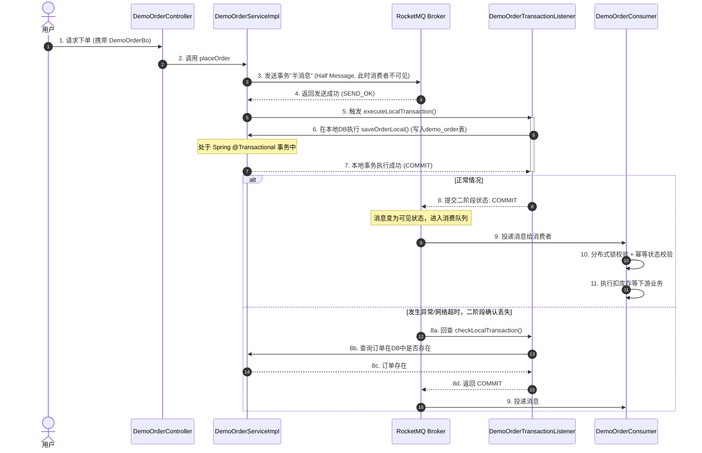

# RocketMQ 生产级集成与订单下单服务设计指南

本指南详细介绍了如何在 `RuoYi-Vue-Plus`（Spring Boot 3.x）项目中引入并配置 Apache RocketMQ，并通过一个生产级别的订单下单服务（包含**分布式事务**、**高并发削峰**、**消息防丢失**、**消费幂等性**设计）来展示具体实现与教科书级别的架构设计。

---

## 一、 本地 RocketMQ 环境准备

在启动项目之前，需要本地或服务器部署 RocketMQ (以 5.x 版本为例)。

### 1. 启动 NameServer
```bash
# Windows 环境
bin/mqnamesrv.cmd
```

### 2. 启动 Broker
需要开启自动创建 Topic 选项（开发调试用，生产建议关闭）：
```bash
# Windows 环境
bin/mqbroker.cmd -n 127.0.0.1:9876 autoCreateTopicEnable=true
```

---

## 二、 订单业务内容及架构设计介绍

本项目实现的业务是 **用户下单并触发下游扣减预留库存、积分发放等业务**。

### 1. 代码文件结构

所有编写的代码已放入 `ruoyi-demo` 模块中，符合 `RuoYi-Vue-Plus` 的包命名与编码标准：

*   **实体与数据流转对象**
    *   [DemoOrder.java](file:///D:/develop/soy/RuoYi-Vue-Plus/ruoyi-modules/ruoyi-demo/src/main/java/com/iwip/demo/domain/DemoOrder.java): 订单实体类，继承 `TenantEntity` 以自动支持多租户及 `BaseEntity` 的创建/更新时间字段，启用乐观锁。
    *   [DemoOrderBo.java](file:///D:/develop/soy/RuoYi-Vue-Plus/ruoyi-modules/ruoyi-demo/src/main/java/com/iwip/demo/domain/bo/DemoOrderBo.java): 下单请求参数接收与校验类。
    *   [DemoOrderVo.java](file:///D:/develop/soy/RuoYi-Vue-Plus/ruoyi-modules/ruoyi-demo/src/main/java/com/iwip/demo/domain/vo/DemoOrderVo.java): 订单数据展示类，已集成 FastExcel 导出注解与 Mapstruct 映射配置。
*   **持久层**
    *   [DemoOrderMapper.java](file:///D:/develop/soy/RuoYi-Vue-Plus/ruoyi-modules/ruoyi-demo/src/main/java/com/iwip/demo/mapper/DemoOrderMapper.java): MyBatis-Plus Mapper 接口。
*   **控制层**
    *   [DemoOrderController.java](file:///D:/develop/soy/RuoYi-Vue-Plus/ruoyi-modules/ruoyi-demo/src/main/java/com/iwip/demo/controller/DemoOrderController.java): 提供下单 `/demo/order/place` 及获取详情 `/demo/order/{id}` 接口。
*   **服务层**
    *   [IDemoOrderService.java](file:///D:/develop/soy/RuoYi-Vue-Plus/ruoyi-modules/ruoyi-demo/src/main/java/com/iwip/demo/service/IDemoOrderService.java): 订单服务接口。
    *   [DemoOrderServiceImpl.java](file:///D:/develop/soy/RuoYi-Vue-Plus/ruoyi-modules/ruoyi-demo/src/main/java/com/iwip/demo/service/impl/DemoOrderServiceImpl.java): 订单服务实现，集成了事务消息的发送逻辑。
*   **消息队列中间件**
    *   [DemoOrderTransactionListener.java](file:///D:/develop/soy/RuoYi-Vue-Plus/ruoyi-modules/ruoyi-demo/src/main/java/com/iwip/demo/mq/producer/DemoOrderTransactionListener.java): RocketMQ 事务监听器，负责执行本地 DB 下单事务，并响应 RocketMQ Broker 对本地事务状态的回查。
    *   [DemoOrderConsumer.java](file:///D:/develop/soy/RuoYi-Vue-Plus/ruoyi-modules/ruoyi-demo/src/main/java/com/iwip/demo/mq/consumer/DemoOrderConsumer.java): 订单消息消费者，演示基于 **分布式锁** 与 **幂等状态表** 的幂等防重复设计。

### 2. 数据库设计 (MySQL DDL)
使用前请确保在数据库中创建如下表结构（适配 RuoYi-Vue-Plus 多租户规范）：
```sql
CREATE TABLE `demo_order` (
  `id` bigint NOT NULL COMMENT '主键ID',
  `order_no` varchar(64) NOT NULL COMMENT '订单号',
  `user_id` bigint NOT NULL COMMENT '用户ID',
  `goods_id` bigint NOT NULL COMMENT '商品ID',
  `goods_count` int NOT NULL COMMENT '商品数量',
  `amount` decimal(10,2) NOT NULL COMMENT '订单金额',
  `status` int NOT NULL DEFAULT '0' COMMENT '订单状态 (0:待支付, 1:已支付, 2:已取消, 3:已失效)',
  `version` bigint NOT NULL DEFAULT '0' COMMENT '乐观锁版本',
  `del_flag` bigint NOT NULL DEFAULT '0' COMMENT '删除标志 (0存在 2删除)',
  `tenant_id` varchar(20) DEFAULT '000000' COMMENT '租户ID',
  `create_dept` bigint DEFAULT NULL COMMENT '创建部门',
  `create_by` bigint DEFAULT NULL COMMENT '创建人',
  `create_time` datetime DEFAULT NULL COMMENT '创建时间',
  `update_by` bigint DEFAULT NULL COMMENT '更新人',
  `update_time` datetime DEFAULT NULL COMMENT '更新时间',
  PRIMARY KEY (`id`),
  UNIQUE KEY `uk_order_no` (`order_no`)
) ENGINE=InnoDB DEFAULT CHARSET=utf8mb4 COMMENT='演示订单表';
```

### 3. 业务流程与事务消息核心机制 (Mermaid 流程图)

为了解决“**数据库下单成功，但消息发送失败导致下游不执行**”或者“**消息发送成功，但数据库回滚导致下游错误执行**”的分布式事务问题，本项目采用了 RocketMQ 经典的**事务消息 (Transactional Message)** 机制。



---

## 三、 教科书级：MQ 高并发、防丢失、防重复与幂等性全套生产方案

在大型分布式系统或高并发电商场景下，消息队列的安全设计是重中之重。以下是应对这三大问题的生产级保障方案。

### 1. MQ 如何应对高并发？(流量削峰与异步解耦)
*   **同步变异步**：当用户下单时，核心步骤只有“生成订单号”与“写入订单表”两步，而耗时的“短信通知”、“赠送积分”、“物流单生成”等后续步骤并不需要主流程等待。通过 MQ 将它们异步化，极大缩短响应时长（RT），提高吞吐量。
*   **缓冲池削峰**：在高并发大促场景下，瞬时订单流量可能达到平常的数十倍。数据库很难承受如此高频的写入。MQ 可以作为大流量的缓冲池，下游消费端根据自身的处理能力，以平滑、稳定的速率拉取消息消费，避免数据库被瞬间冲垮。

---

### 2. 零丢失方案：消息如何保证绝对不丢失？
消息在 MQ 中的生命周期包含：**生产阶段** ->   **存储阶段** ->   **消费阶段**。保证消息不丢失，必须在三个阶段同时发力：

#### ① 生产阶段（Producer -> Broker）
*   **事务消息防悬挂**：使用 RocketMQ 的**半消息 (Half Message)** 机制，先发送半消息，成功后再执行本地事务，事务成功后再确认消息。确保了“数据库更新”与“消息发送”的强原子性。
*   **同步发送 + 重试机制**：普通消息发送应采用同步方式（`syncSend`），并设置重试次数（如配置的 `retry-times-when-send-failed: 3`），确保网络抖动时能自动重试。
*   **备用出收件箱（本地消息表）**：若 MQ 彻底宕机导致发送失败，将消息先落库（本地备用消息表），后续由定时任务轮询重试补发。

#### ② 存储阶段（Broker 内部）
*   **同步刷盘（Sync Flush）**：
    *   *默认异步刷盘（Async Flush）*：写入 Broker 内存后立即返回成功，若此时 Broker 宿主机宕机，未写入磁盘的数据会丢失。
    *   *生产配置*：修改 Broker 配置为 `flushDiskType=SYNC_FLUSH`。必须等数据写入物理磁盘才向生产者返回发送成功。
*   **多副本主从同步复制（Sync Replication）**：
    *   *生产配置*：采用多主多从集群，且主从同步方式设置为 `brokerRole=SYNC_MASTER`。消息不仅要刷到 Master 磁盘，还要同步复制到 Slave 的磁盘后才算成功。

#### ③ 消费阶段（Consumer <- Broker）
*   **手动 ACK 确认机制**：
    *   *默认机制*：RocketMQ 消费端在 `onMessage` 方法中未抛出异常，即视为消费成功，自动发送 ACK。
    *   *生产配置*：禁止在消费端进行类似 `try-catch { log.error(".."); }` 但不抛出异常的行为。**遇到任何业务执行失败，必须抛出异常**，使 RocketMQ 知道消费失败，触发重试。
*   **消费重试与死信队列（DLQ）**：
    *   消费失败的消息会以 `1s 5s 10s...` 的时间间隔进行最多 16 次的指数退避重试。
    *   重试 16 次均失败的消息会进入 **死信队列（Dead Letter Queue, DLQ）**，需要运维人员监控报警，由人工干预或脚本重新投递。

---

### 3. 幂等性与防重复方案：如何实现一次且仅一次消费？
在分布式网络中，由于网络超时重试（Producer超时重试、Broker重发、Consumer重平衡），**消息重复投递是 100% 会发生的**。MQ 自身不保证消息不重复（仅保证 At Least Once），因此**幂等性必须由消费端保证**。

以下是生产环境中最常用的幂等设计三板斧：

#### ① 唯一索引法（终极防线）
*   **原理**：在消费端的业务数据库中，建立一张**幂等状态表**（或直接在业务表中建立唯一索引）。在消费消息前，先往该表插入一条记录（例如以 `order_no` 作为唯一主键）。
*   **动作**：如果插入成功，说明该消息从未被消费过，继续执行业务；如果抛出 `DuplicateKeyException` 唯一性约束冲突异常，说明有其他线程正在消费或已消费成功，当前线程直接结束。
*   *适用场景*：强事务性、必须落库的业务。

#### ② 状态机控制（最常用、最轻量）
*   **原理**：很多业务单据都有明确的状态变更链条。例如订单状态：`待支付(0) -> 已支付(1) -> 已发货(2) -> 已完成(3)`。
*   **动作**：执行更新时，SQL 必须带上状态前置判定：
    ```sql
    UPDATE demo_order SET status = 1, update_time = NOW() WHERE id = 123 AND status = 0;
    ```
    如果影响行数为 `0`，说明订单状态已被修改过（可能已被并发消费线程或先前消费修改），直接返回成功，不进行后续处理。

#### ③ 分布式锁控制（防瞬时并发重复）
*   **原理**：当两条一模一样的重复消息在毫秒级内被两个 Consumer 实例并行消费时，由于时间极短，两边可能都发现“业务未处理过”，然后同时插入，造成数据错乱。
*   **动作**：在消费入口处，使用 `Redisson` 对业务唯一键（如 `order_no`）加分布式锁：
    *   *tryLock(0, 15, SECONDS)*：如果拿不到锁，说明此时有另一个 Consumer 正在执行该订单 of 业务。直接抛异常让 MQ 延时重试，避免并发执行。
    *   拿到锁后，首先执行 **双重检查（Double Check）**，看 DB 或 Redis 中该消息的状态是否已处理完毕。处理完毕后释放锁，不重复执行。

---

## 五、 生产保障配置清单 (直接上战场配置)

若您想把 RocketMQ 接入生产环境，请参照以下配置调整参数：

### 1. 生产者关键配置 (Spring Boot Application.yml)
```yaml
rocketmq:
  name-server: 192.168.1.100:9876,192.168.1.101:9876 # 双NameServer高可用
  producer:
    group: order-producer-group
    send-message-timeout: 5000       # 发送超时设置大一些，网络抖动时有容错空间
    retry-times-when-send-failed: 3  # 同步发送失败重试次数
    max-message-size: 4194304        # 限制消息体大小，不超过4MB
```

### 2. 消费者关键配置 (Spring Boot Consumer class)
```java
@RocketMQMessageListener(
    topic = "demo_order_topic",
    consumerGroup = "demo_order_consumer_group",
    consumeMode = ConsumeMode.CONCURRENTLY, # 并发消费模式
    messageModel = MessageModel.CLUSTERING,  # 集群消费模式 (一条消息只由组内一个消费者消费)
    maxReconsumeTimes = 5                    # 生产建议降低重试次数，默认16次可能导致单条消息阻塞时间过长，5-8次即可进入DLQ
)
```
